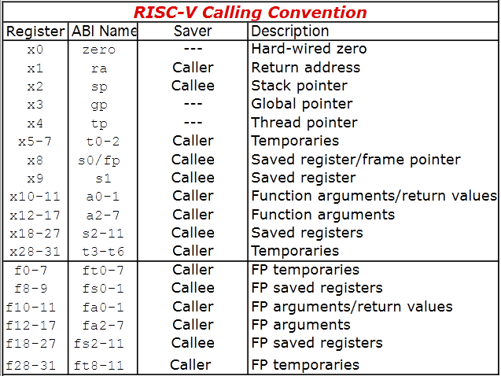
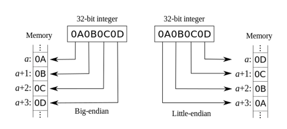
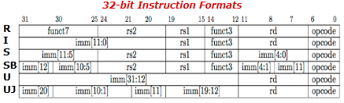
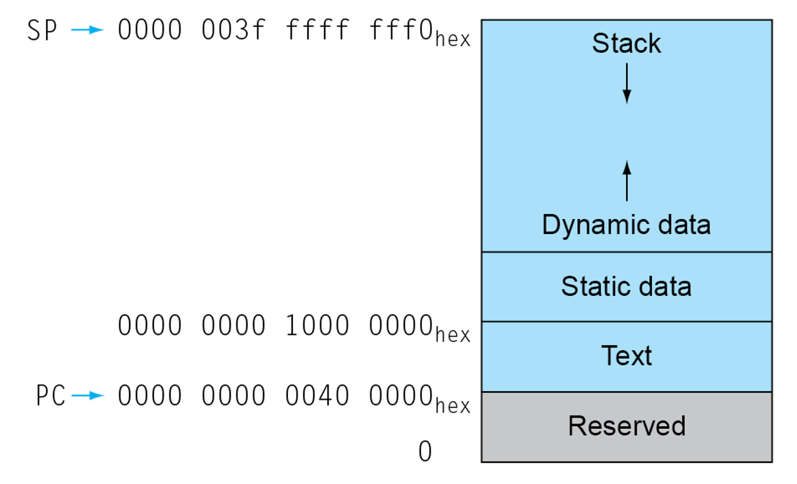

# Chapter 2 - Assembly

## Design Principles

- **Principle 1: Simplicity favors regularity**
  - Regularity makes implementation simpler
  - Simplicity enables higher performance at lower cost
- **Principle 2: Smaller is faster**
  - Ex: main memory is larger, but slower than register & cache
- **Principle 3: Good design demands good compromises**
  - Different formats complicate decoding, but allow uniform length instructions.

---

## Register Operands

- RISC-V has a 32*64 register file:
  - For frequently accessed data.
  - 64-bit is "double word"
  - 32-bit is "word"
- 
  - Caller saved: Caller push values into stack before calling.
  - Callee saved: Callee save values into stack before using, and restore them before return.


### Example

C code:
```c
f = (g+h) - (i+j);
```

Compiled RISC-V code:`

```assembly
dd x5, x20, x21
add x6, x22, x23
sub x19, x5, x6
```

---

## Memory Operands

- For composite data:
  - Arrays, structures, dynamic data
- To apply arithmetic operations:
  - Load from memory to registers.
  - Store result to memory.

- Memory is byte addressed. Each address identifies a byte (8-bit).

- RISC-V is little endian.
  - 


### Example

C code
```c
A[12] = h + A[8]
```

Compiles RISC-V code
```assembly
ld x9, 64(x22)
add x9, x21, x9
sd x9, 96(x22)
```

---

## Register vs Memory

- Register are faster to access than memory.
- Operations on memory requires load and store. More Instructions to be executed.
- Compiler must use registers for variables as much as possible.
  - Only spill to memory for less frequently used variables.
  - Register optimization is important.

---

## Immediate Operands

- Constant data specified in instruction.
- **Makes common cases fast.**
  - Small constants are common.
  - Avoids load instructions.

---

## Instruction Formats



---

## Basic blocks

- A basic block is a sequence of instructions where:
  - No embedded branches except at the end
  - No branch targets except at the start
- Some compiler and processor can optimize performance by changing the order of execution within a basic block, without affecting dependencies.

---

## Procedure Calling

1. Place parameters in reg `x10` to `x17`.
2. Transfer control to procedure.
3. Acquire storage for procedure.
4. Perform operations.
5. Place result in register for caller.
6. Return to caller.

### Instructions

Procedure call: jump and link

```assembly
jal x1, <label>
```
- Address of following instructions put in `x1` (return address).
- Jump to target address.

Procedure return: jump and link register
```assembly
jalr x0, 0(x1)
```
- Jumps to `x1` with `0` shift.
- Use `x0` as `rd`.
- Can also used for `for`, `switch/case`

### Example

C code

```c
long long int fact(long long int n) {
    if (n<1) return 1;
    else return n*fact(n-1);
}
```

RISC-V

```assembly
fact:
	addi sp, sp, -16
	sd x1, 8(sp)
	sd x10, 0(sp) # argument
	addi x5, x10, -1
	bge x5, zero, else # IF
	addi x10, zero, 1
	addi sp, sp, 16
	jalr x0, 0(x1)
else:
	addi x10, x10, -1 # x10 = n-1
	jal x1, fact # fact(n-1)
	addi x6, x10, 0
	ld x10, 0(sp)
	ld x1, 8(sp)
	addi sp, sp, 16
	mul x10, x10, x6 # x10 = n*fact(n-1)
	jalr x0, 0(x1) # return
```

---

## Memory Layout



- Stack: automatic storage
- Dynamic data: heap
  - `malloc` in C, `new` in Java
- Static data: global variables
  - `x3` (global pointer) for this area.
- Text: program code

---

## 32-bit constant

```assembly
lui rd, constant
```

Loads the first 20 bits of immediate. Using with `addi` allows 32-bit immediate.

---

## Addressing For Branch & Jump

### Branch

- Branch targets are mostly near branch
- Uses 11-bit immediate.
- $\text{Target Address} = \text{PC} + \text{immediate}\times2$

### Jump

- `jal` uses 20-bit immediate.
- For longer jumps, use `lui`(upper 20-bit) + `jalr`(12-bit)

---

## Synchronization

- Load reserved: `lr.d rd, (rs1)`
  - Place reservation (like a read lock) on memory address
- Store conditional: `sc.d rd, (rs1), rs2`
  - Succeeds if target address not changed since `lr.d`. Return `0` in `rd`.
  - Fails if changed. Return non-zero in `rd`.

---

## Array vs Pointers

- Array requires shifts (multiplying) done inside loop.
- Compiler optimization can achieve the same effect as explicitly using pointers.
  - Making programs clearer and safer.

---

## Fallacies & Pitfalls

- Powerful instructions means higher performance
  - Fewer instructions required.
  - But the more complex, the harder to implement. Might even slow down simple instructions.
- Use assembly for high performance
  - Modern compilers are much better at dealing with modern processors.
  - More lines means more errors & less productivity.
- Backward compatibility
- Sequential address $\ne$ sequential words


