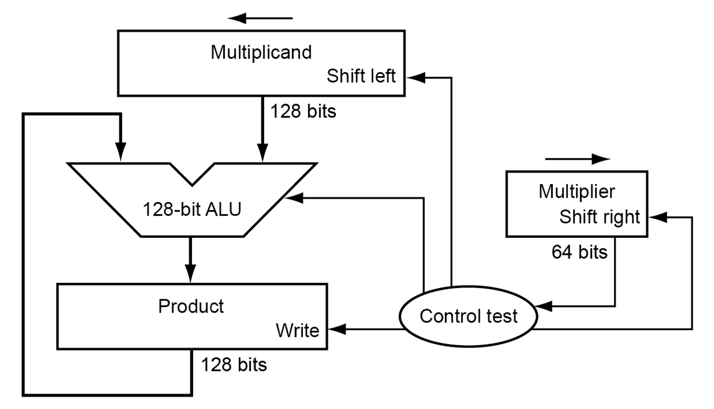
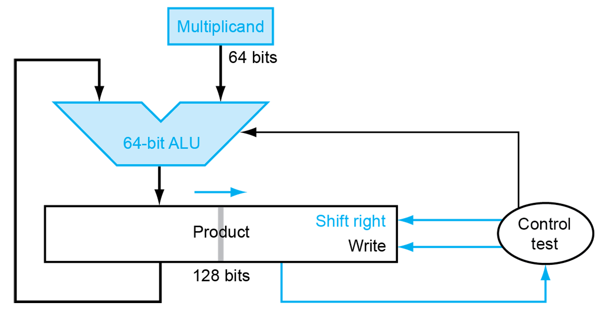

# Chapter 3 - Arithmetic

## Integer Addition & Subtraction

- Addition overflow
  - pos + neg &#8658; no overflow
  - pos + pos &#8658; overflow if result < 0
  - neg + neg &#8658; overflow if result > 0
- Subtraction overflow
  - same sign subtracts &#8658; no overflow
  - pos - neg &#8658; overflow if result < 0
  - neg - pos &#8658; overflow if result > 0
- On multimedia
  - Graphics & media processing uses 8-bit & 16-bit.
    - 64-bit adder, with partitioned carrying.
    - SIMD
  - When overflow, result should be largest representable value.

## Integer Multiplication

- Naive long multiplication
  
- Optimized
  
  - Left shift multiplicand = right shift product.
  - Place multiplier & product on the same 128-bit register.

- Even faster
  - Use multiple adders.
  - Cost/performance tradeoff

## Integer Division

- Use long division approach.
- For signed division, divide with absolute values then deal with sign.
- Optimized divider looks a lot like a optimized multiplier.
- In RISC-V, overflow & division-by-zero returns undefined results, don't produce errors.

## Floating Point

### Format

|        | Sign  | Exponent | Fraction |
| ------ | :---: | :------: | :------: |
| Single | 1 bit |  8 bits  | 23 bits  |
| Double | 1 bit | 11 bits  | 52 bits  |

$$
x = {(-1)}^{\text{Sign}} \times (1+\text{Fraction})\times2^{\text{Exponent $-$ Bias}}
$$

Bias = 127 (single) or 1023 (double)

### Denormal numbers, Infinity, NaN

- Exponent are all zeroes $\Rightarrow$ hidden bit is 0
  $x = {(-1)}^{\text{Sign}} \times (0+\text{Fraction})\times2^{\text{$-$ Bias}}$

- Two representation for 0 ($\pm0.0$).

- Exponent = 111...1, Fraction = 000.0 &#8658; $\pm\infty$

- Exponent = 111...1, Fraction is not 0 &#8658; NaN

  - For illegal or undefined result.

## FP Addition

1. Align binary points
   - Shift number with smaller exponent
2. Add significands
3. Normalize result & check for overflow/underflow
4. Round and renormalize (if necessary)

### Adder hardware

- FP adders are more complex.
- Doing this in one cycle would slow down other operations.
- Usually takes several cycles. Thus can be pipelined.

## FP Multiplication

1. Add exponents
2. Multiply significands
3. Normalize result & check for over/underflow
4. Round and renormalize (if necessary)
5. Determine sign

## Accurate FP

- IEEE 754 on rounding control
  - Guard, round, sticky bits for precision
  - Rounding modes
- Not all options are implemented in reality
- Important for scientific computation
