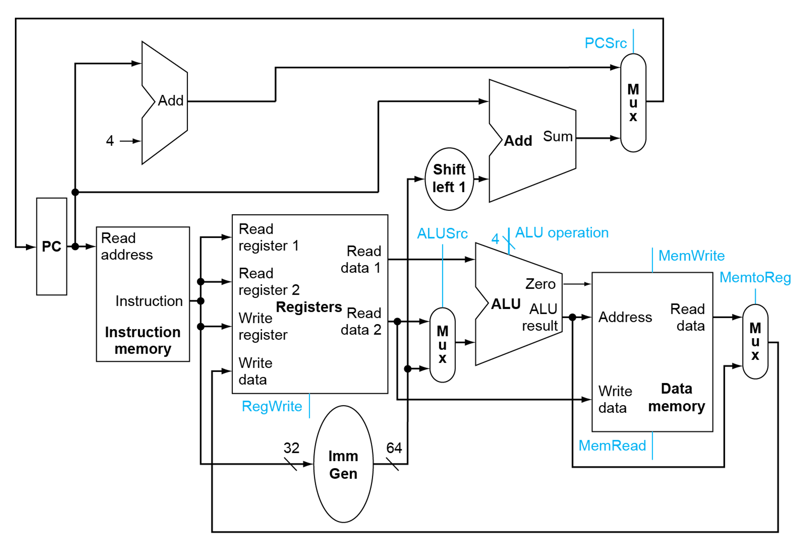
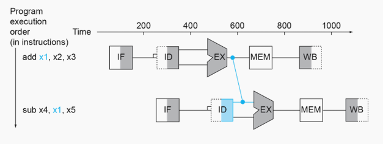
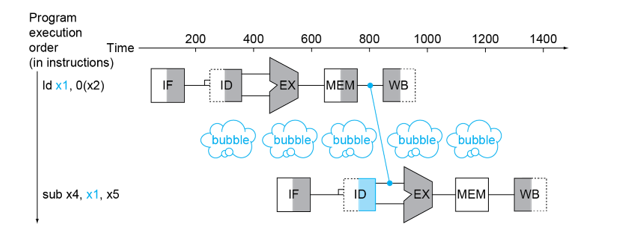
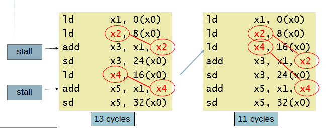
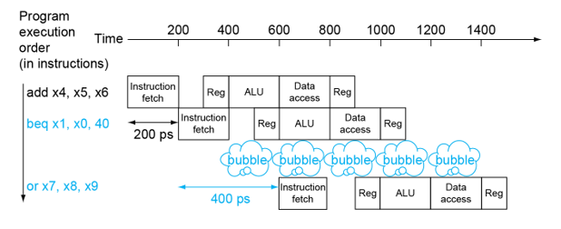
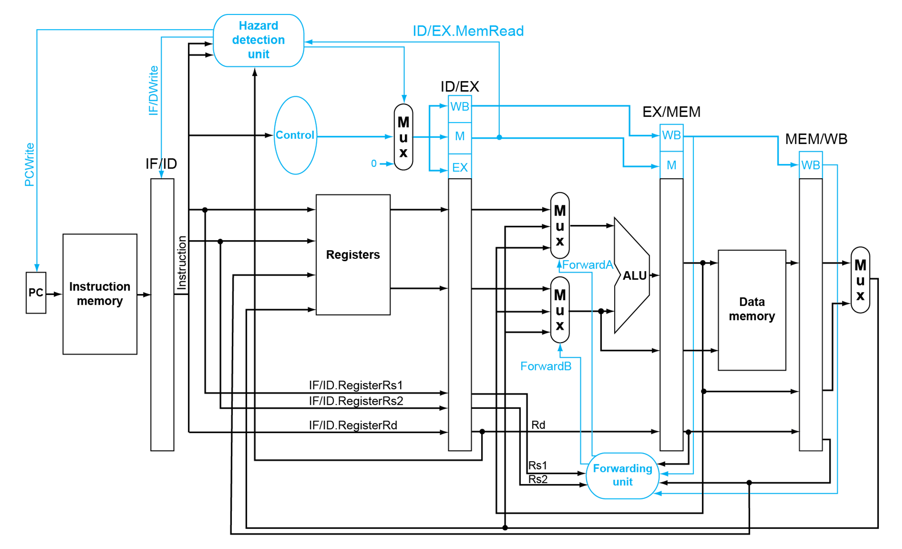

# Chapter 4 - Processor

## Intro

- Two RISC-V implementations
  - Simplified version
  - Pipelined version
- A simple subset of operations
  - Memory: `ld`, `sd`
  - Arithmetic: `add`, `sub`, `and`, `or`
  - Control transfer: `beq`

## Instruction Execution

- PC $\Rightarrow$ instruction memory, fetch instruction
- Register numbers &#8658; register file, read registers
- Depending on instruction class
  - Use ALU to calculate:
    - Arithmetic result
    - Memory address
    - Branch comparison
  - Access data memory for load/store
  - PC = target address or PC + 4

## Simplified Version

### Datapath



### Datapath + control


### Performance issues

- Longest delay determines clock period.
  - Critical path: `ld`
    Instruction memory &#8594; register file &#8594; ALU &#8594; data memory &#8594; register file
- Not feasible to vary period for different instructions.
- Violates design principle: ***Make common cases fast***.

## Pipelined Version

### RISC-V pipeline stages

1. IF: Fetch instruction from memory
2. ID: Decode instruction & read from register
3. EX: Execute operation or calculate address
4. MEM: Access memory operand
5. WB: Write result back to register

### Pipeline speedup

- If all stages are balanced:
  $$
  \text{Time between ins}_{\text{pipelined}}
  = \frac{\text{Time between ins}_{\text{non-pipelined}}}{\text{\# stages}}
  $$

- If not balanced, speedup is a bit less.

- Speedup due to increased throughput. (Latency is still the same)

### Pipeline & RISC-V design

- All instructions are 32-bits
  - Easier to fetch & decode in one cycle.
- Few and regular formats
  - Decode & read registers in one step.
- Load/store addressing
  - Calculate address in 3rd stage, then access in 4th stage.

### Structure hazard

- Conflict for use of a resource.
- Pipeline with single memory
  - Load/store requires access.
  - Instruction fetch also requires access.
  - They have to wait for each other.

### Data hazard

An instruction depends on data from previous instructions + read after write(RAW).

```assembly
add x19, x0, x1
sub x2, x19, x3
```

#### Forwarding

- Use result once it's computed.
- Skip waiting it to be stored into a register.
- Requires extra connections.
  

- Can't always avoid stalls with just forwarding. (Ex: Load-Use)
  

#### Detecting need to forward

**Data hazard**

- Data hazards when:
  - EX/MEM.RegRd = ID/EX.RegRs1
  - EX/MEM.RegRd = ID/EX.RegRs2
  - MEM/WB.RegRd = ID/EX.RegRs1
  - MEM/WB.RegRd = ID/EX.RegRs2
- Only forward if the instruction is writing to register.
  - EX/MEM.RegWrite
  - MEM/WB.RegWrite
- And only if that instruction's Rd $\ne$ 0

**Double data hazard**

```assembly
add x1, x1, x2
add x1, x1, x3
add x1, x1, x4
```

- Both cases for data hazard occur. We want to use the most recent one.
- Revise MEM hazard condition. Only forward when EX hazard isn't true.

**Load-use hazard detection**

- Check when using instruction is decoded in ID stage.
- Load-use hazard when:
  - ID/EX.MemRead and
    (ID/EX.RegRd = IF/ID RegRs1
    or ID/EX.RegRd = IF/ID RegRs2)
- If detected, stall and insert bubble (nop)
- To stall pipeline:
  - Force control values in ID/EX register to 0
    - No operation on EX, MEM, WB
  - Prevent update of PC and IF/ID reg
    - Decode using instruction again
    - Fetch the following instruction again
    - 1-cycle stall allows mem to read data for `ld`


#### Code scheduling

Reorder code to avoid using load result in the next instruction.



### Control / Branch hazard

- Branch determines flow of control.
  - Fetching next instruction depends on branch output.
  - Pipeline can't always fetch correct instruction.
- Need to compare and compute target early in the pipeline.
- Move the needed hardware for determining outcome to ID stage.
  - Target address adder * register comparator


#### Stall on branch

Wait until branch outcome.



#### Branch Prediction

- Stall penalty becomes unacceptable on longer pipelines.
- Predicts branch outcome
  - Stall only if prediction is wrong.
- Static branch prediction
  - Based on typical branch behavior.
  - Example: loop & if branches

#### Dynamic branch prediction

- Use recent history to predict. Assume future behaviors continue the trend.
- Branch prediction buffer / history table
- Indexed by "recent branch instruction's address"
- Stores that out come (taken / not taken)
- To execute
  1. Check buffer, guess the same outcome.
  2. Start fetching.
  3. If wrong, flush pipeline and flip prediction.
- 2-bit predictor
  - Only change prediction on two successive misses.

### Datapath + control




