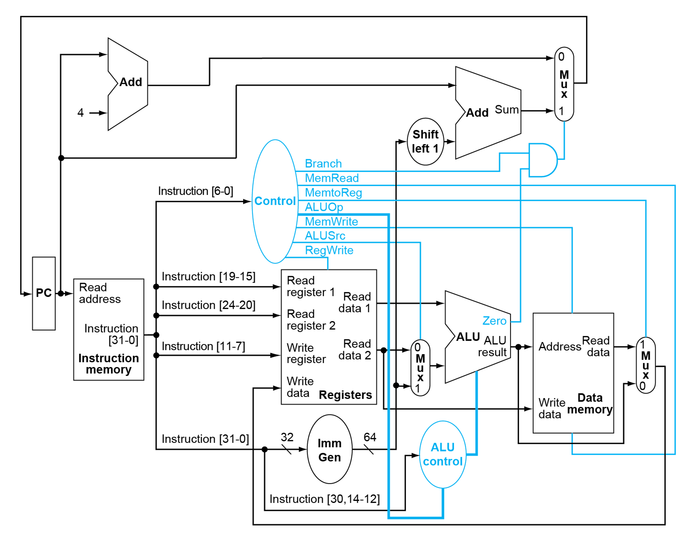

# Chapter 4 - Processor

## Intro

- Two RISC-V implementations
  - Simplified version
  - Pipelined version
- A simple subset of operations
  - Memory: `ld`, `sd`
  - Arithmetic: `add`, `sub`, `and`, `or`
  - Control transfer: `beq`

## Instruction Execution

- PC $\Rightarrow$ instruction memory, fetch instruction
- Register numbers &#8658; register file, read registers
- Depending on instruction class
  - Use ALU to calculate:
    - Arithmetic result
    - Memory address
    - Branch comparison
  - Access data memory for load/store
  - PC = target address or PC + 4

## Simplified Version

### Datapath

### Datapath + control

### Performance issues

- Longest delay determines clock period.
  - Critical path: `ld`
    Instruction memory &#8594; register file &#8594; ALU &#8594; data memory &#8594; register file
- Not feasible to vary period for different instructions.
- Violates design principle: ***Make common cases fast***.

## Pipelined Version

