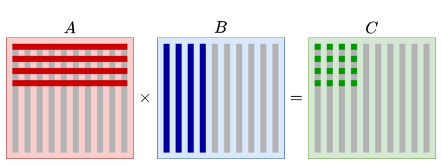

# HW2

 b09902004 資工二 郭懷元

## 2.8

```
addi x30, x10, 8 --> x30 = A+1
addi x31, x10, 0 --> x31 = A
sd x31, 0(x30) --> *(x30) = x31 --> *(A+1) = A --> A[1] = A
ld x30, 0(x30) --> x30 = *(x30) --> x30 = *(A+1) = A
add x5, x30, x31 --> f = A + A
```

```c
A[1] = A;
f = A[1] + A;
```

## 2.9

| instruction        | `opcode` | `rs1`   | `rd`    | `rs2`   | `imm`   | `funct3` | `funct7` |
| ------------------ | -------- | ------- | ------- | ------- | ------- | -------- | -------- |
| `addi x30, x10, 8` | `010011` | `01010` | `11110` |         | `0x008` | `000`    |          |
| `addi x31, x10, 0` | `010011` | `01010` | `11111` |         | `0x000` | `000`    |          |
| `sd x31, 0(x30)`   | `100011` | `11110` |         | `11111` | `0x000` | `011`    |          |
| `ld x30, 0(x30)`   | `000011` | `11110` | `11110` |         | `0x000` | `011`    |          |
| `add x5, x30, x31` | `110011` | `11110` | `00110` | `11111` |         | `000`    | `000`    |

## 2.16

### 2.16.1

`funct7`, `funct3`, `opcode`: These bit fields might increase in size to accommodate the four times as many instructions.

`rs2`, `rs1`, `rd`: These bit fields should increase from 5 bits to 7 bits for the 128 registers.

### 2.16.2

`funct3`, `opcode`: These bit fields might increase in size to accommodate the four times as many instructions.

`rs1`, `rd`: These bit fields should increase from 5 bits to 7 bits for the 128 registers.

`imm`: This field doesn't need to change, because neither the number of registers or instructions have to do with `imm`.

### 2.16.3

Decrease in size: Because there are more registers and more instructions, some old instructions can now be combined into just a single instruction.

Increase in size: Because instructions now takes up more bits, for simple tasks that doesn't use many registers, the extra bits are wasted and take up unnecessary spaces.

## Matrix Multiplication Report

> Refs:
>
> https://en.wikipedia.org/wiki/Loop_nest_optimization
> https://github.com/flame/how-to-optimize-gemm/wiki

Result: `8960429 cycles`

### Strategy



- Dot $2$ rows of $A$ and $4$ columns of $B$ at a time, so that when a value from $A$ or $B$ is read from memory to register, it can be used multiple times.
- Use pointers and indirect addressing to access $A$ and $B$.
- I tried memory blocking to keep data in L1 and L2 cache, but somehow it didn't work, and the performance is even worse.

### Questions

**How many cycles does it take by just doing the naive matrix multiplication?**

The naive C implementation with gcc `-O3` optimization takes slightly more than 16M cycles.

**How many load and store does it need (roughly) during the whole computation? (Considering the**
**registers it use)**

In the naive implementation, $C$ is stored once, $A$ and $B$ are both loaded into register $128$ times.
So total store is about $2^{7\times2} = 2^{14}$ times and total load is about $2\times2^7\times2^{7\times2}=2^{22}$ times.

With my strategy, $C$ is also stored once, $A$ is loaded $\frac{128}{4}=32$ times, and $B$ is loaded $\frac{128}{2} = 64$ times.
So total store is $2^{14}$ times, and total load is $2^5\times2^{14}+2^6\times2^{14}=3\times2^{19}$ times, $\frac{3}{8}$ of naive implementation.

**Is there any way to keep registers being used as much as possible before they’re replaced? (Hint:**
**blocking)**

Yes. My strategy is intended to keep reusing registers as much as possible. The number of rows and columns we dotted at a time is bounded by how many registers are available.

**How many loop controls does it need (roughly) during the whole computation?**

Both naive implementation and my strategy uses $3$ loop controls.

