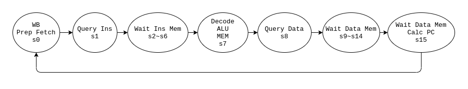
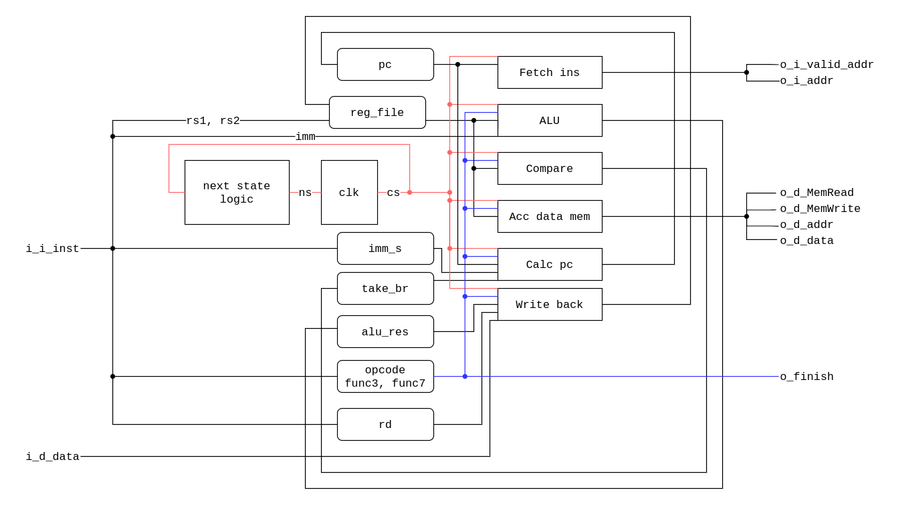

# HW3 Report

b09902004 資工二 郭懷元

> Refs:
> 
> https://hackmd.io/@sysprog/ByzoiggIb

## ALU

### unsigned arithmetic

- Overflows in `Signed Add` and `Signed Sub` are detected with an additional bit in the front.

- Overflows in `Signed Mul` are detected by using a 64-bit register to store the full result, then check if that overflows 32 bits.

### signed arithmetic

- Overflows in `Unsigned Add` are detected by `(a_msb~^b_msb)&(a_msb^o_msb)`.

- Overflows in `Unsigned Sub` are detected by `(a_msb^b_msb)&(a_msb^o_msb)`.

- Overflows in `Unsigned Mul` are detected by using a 64-bit register to store the full result, then check if that's out of range.

### bit operations

- `BitReverse`:
  
  ```verilog
  o_data_w = ((o_data_w&32'hffff0000)>>16|(o_data_w&32'h0000ffff)<<16);
  o_data_w = ((o_data_w&32'hff00ff00)>>8|(o_data_w&32'h00ff00ff)<<8);
  o_data_w = ((o_data_w&32'hf0f0f0f0)>>4|(o_data_w&32'h0f0f0f0f)<<4);
  o_data_w = ((o_data_w&32'hcccccccc)>>2|(o_data_w&32'h33333333)<<2);
  o_data_w = ((o_data_w&32'haaaaaaaa)>>1|(o_data_w&32'h55555555)<<1);
  ```
  
   This algorithm use bit masks to achieve reversing.

- Other operations are done naively.

## FPU

### `Add`

- Because the maximum right shift amount possible here is 253(0xFE-0x01), I use a 277-bit register to store fractions.

- The hardware can be split into 4 parts:
  
  1. Shift the input fraction with smaller exponent.
  2. Add or subtract fractions and calculate sign according to their sign.
     - An additional bit is used for overflow detection, which is used in normalizing.
  3. Normalize output.
  4. Round to nearest even and re-normalize if needed.

### `Mul`

- The hardware can be split into 5 parts:
  
  1. Add exponents
  
  2. Multiply fractions
     
     - Because the calculation here is:
       
       $$
       (1.\text{frac}_1\times2^{23})\times(1.\text{frac}_{b}\times2^{23})
= 1.\text{frac}_{o} \times 2^{46}
       $$
       
       I use a 47-bit register to store output fraction, and a 1-bit register for overflow.
  
  3. Normalize output.
  
  4. Calculate sign.
  
  5. Round to nearest even and re-normalize if needed.

## CPU



I define 16 states for CPU. And at every rising edge of clock, the CPU enters the next stage.

- Stage 0
  
  - Write data to register if needed.
  - Prepare data for fetching instruction.

- Stage 1
  
  - `o_i_valid_addr` is toggled and `o_i_addr` is set.

- Stage 2-6
  
  - Wait for memory IO.

- Stage 7
  
  - Decode the instruction. Extend immediate to 64 bits.
  - Do the arithmetic needed.
  - Compare for branching.
  - Prepare data for data memory IO.

- Stage 8
  
  - `o_d_*` ports have values set.

- Stage 9-15
  
  - Wait for memory IO.
  - On stage 15, calculate `pc`'s next value.

A rough block diagram of my design is below:


