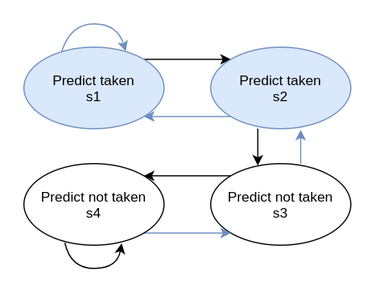
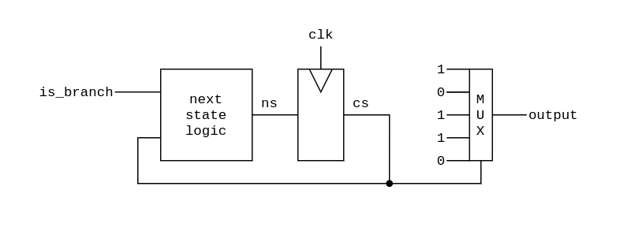
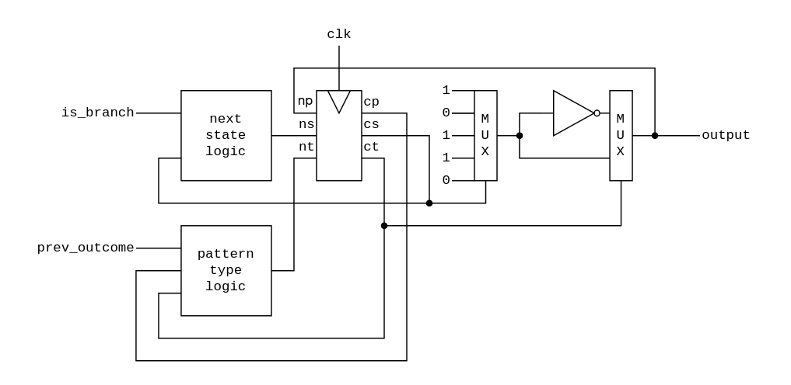

# Handwritten

b09902004 資工二 郭懷元

## 4.28

### 4.28.1

|                      | cycle 1 | cycle 2 | cycle 3 | cycle 4 | cycle 5 | cycle 6 | cycle 7 |
| -------------------- | ------- | ------- | ------- | ------- | ------- | ------- | ------- |
| pc<br/>(branch)      | IF      | ID      | EX      | MEM     | WB      |         |         |
| pc+x<br/>(taken)     |         | IF      | ID      |         |         |         |         |
| pc+4<br/>(not taken) |         |         | IF      | ID      | EX      | MEM     | WB      |

When prediction misses, It takes an extra cycle. CPI:

$$
0.25\times(0.45\times1+0.55\times2) + 0.75\times1 = 1.1375
$$

### 4.28.2

CPI:

$$
0.25\times(0.55\times1+0.45\times2)+0.75\times1=1.1125
$$

### 4.28.3

CPI:

$$
0.25\times(0.85\times1+0.15\times2)+0.75\times1=1.0375
$$

### 4.28.4

After conversion, frequency of branch instructions is $12.5\%$, and prediction accuracy remains the same.

New CPI:

$$
0.125\times(0.85\times1+0.15\times2)+0.875\times1=1.01875
$$

Speedup:

$$
\frac{\text{Execution Time}_\text{old}}{\text{Execution Time}_\text{new}}
=\frac{\text{CPI}_\text{old}}{\text{CPI}_\text{new}}
=\frac{1.0375}{1.01875}
\approx 1.018 = 101.8\%
$$

### 4.28.5

After conversion, number of instructions is $100\%+12.5\%=112.5\%$, frequency of branch is $\frac{12.5\%}{112.5\%}=11.1\%$, and prediction accuracy remains the same.

New CPI:

$$
0.111\times(0.85\times1+0.15\times2)+0.889\times1=1.01665
$$

Speedup:

$$
\begin{aligned}
\frac{\text{Execution Time}_\text{old}}{\text{Execution Time}_\text{new}}
&=\frac{\text{CPI}_\text{old}}{\text{CPI}_\text{new}}
\times \frac{\text{\# Instructions}_\text{old}}
{\text{\# Instructions}_\text{new}} \\
&= \frac{1.0375}{1.01665}\times\frac{1}{1.125} \\
&\approx 0.907 \\
&= 90.7\%
\end{aligned}
$$

### 4.28.6

Assume the accuracy on the remaining $20%$ is $p$.

$$
\begin{aligned}
0.8\times1+0.2\times p &= 0.85 \\
\Rightarrow p &= \frac{0.05}{0.2} \\
&= 0.25
\end{aligned}
$$

## 4.29

### 4.29.1

Always-taken accuracy: $\frac{3}{5}=60\%$.

Always-not-taken accuracy: $\frac{2}{5}=40\%$.

### 4.29.2

| Branch number | Prediction | Outcome | Correctness | Next prediction |
| ------------- | ---------- | ------- | ----------- | --------------- |
| 1             | NT         | T       | X           | NT              |
| 2             | NT         | NT      | O           | NT              |
| 3             | NT         | T       | X           | NT              |
| 4             | NT         | T       | X           | T               |

Accuracy: $\frac{1}{4}=25\%$

### 4.29.3

Define the state of predictor as this figure:



| Branch number | Current state | Outcome | Next state | Correctness |
| ------------- | ------------- | ------- | ---------- | ----------- |
| 1             | **s4**        | T       | s3         | X           |
| 2             | s3            | NT      | s4         | O           |
| 3             | s4            | T       | s3         | X           |
| 4             | s3            | T       | s2         | X           |
| 5             | s2            | NT      | **s3**     | X           |
| 6             | **s3**        | T       | s2         | X           |
| 7             | s2            | NT      | s3         | X           |
| 8             | s3            | T       | s2         | X           |
| 9             | s2            | T       | s1         | O           |
| 10            | s1            | NT      | **s2**     | X           |
| 11            | **s2**        | T       | s1         | O           |
| 12            | s1            | NT      | s2         | X           |
| 13            | s1            | T       | s1         | O           |
| 14            | s1            | T       | s1         | O           |
| 15            | s1            | NT      | **s2**     | X           |

The predictor enters a loop at 11-th branch. In this loop, the accuracy is $\frac{3}{5}=60\%$. As the pattern repeats forever, the total accuracy approaches $60\%$.

### 4.29.4



`next state logic` works like this:

```
if (is_branch)
    ns = (cs+1)%5
else
    ns = cs
```

Then `cs` is used to control a multiplexer, which determines the output.

### 4.29.5

The accuracy would be 0.

### 4.29.6



`next state logic` works the same as 4.29.4.

`pattern type logic` works like this:

```
if (cp != prev_outcome)
    nt = ~ct
else
    nt = ct
```

`ct` is used to indicate which type of pattern is given.
