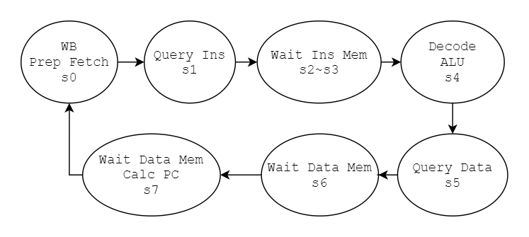
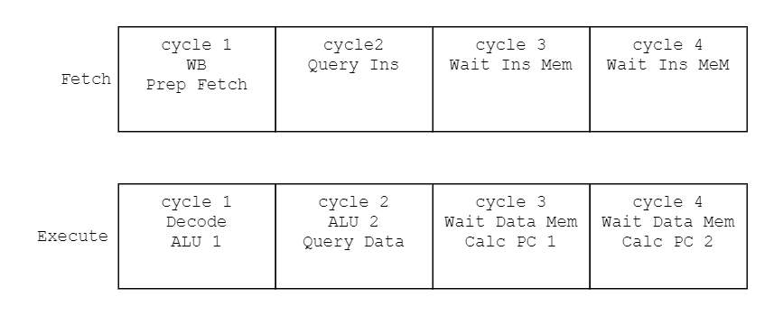

# Report

b09902004 資工二 郭懷元

## Result

| Area         | Latency    | Frequency |
|:------------:|:----------:|:---------:|
| 17986.65 µm² | 2332.45 ps | 428.7 MHz |

| Workload | Cycle counts | Calculated required time |
|:--------:|:------------:|:------------------------:|
| T8       | 31273        | 72942 ns                 |
| T9       | 48089        | 112165 ns                |
| T10      | 73193        | 170719 ns                |

## Design

I didn't implement pipeline in my code, so it's just a FSM.



Here is my proposed 2-stage pipeline design.



## Questions

### What is the latency of each module in your design?

Because I wrote every thing into a single module, so the latency is the CPU's latency 2332.45 ps.

### Which path is the critical path of your cpu? And how can you decrease the latency of it?

```
ABC: Start-point = pi4 ($auto$dfflibmap.cc:519:dfflibmap$69667).  End-point = po2377 (\alu_res_w [62]).
```

The critical path is from instruction memory to ALU's result. To improve ALU's latency:

- `add` and `sub` can be split into two 32-bit addition/subtraction.

- `mul` can be split into two stages. One multiplying the lower half of multiplier, and one multiplying the upper half.

- `xor`, `or` and `and` can be split into two stages. One calculating lower half and one calculating the upper half.

- Bitwise shifting can be done with some hard-wired shifted values and a mux controlled by `imm`.

### How to solve data hazard?

In my proposed design, data is written on to register at the rising edge of second cycle. Therefore a data hazard could happen in these two cases:

- Last finished instruction's `rd` = Execute stage instruction's `rs1`
  `Fetch.rd` = `Execute.rs1`

- Last finished instruction's `rd` = Execute stage instruction's `rs2`
  `Fetch.rd` = `Execute.rs2`

To solve this, connect `reg_file_w[Fetch.rd]` and `reg_file[Execute.rs*]` to a mux, then use the condition above to control this mux.

### How to solve control hazard?

If the compare result is branch-taken (calculated at cycle 2 of execute stage), insert bubble by flushing fetch stage.

### Describe 3 different workloads attributes, and which one can be improved tremendously by branch predictor?

- Workload 1: Many arithmetic instructions in a loop.

- Workload 2: Many branch operations and multiple branch targets.

- Workload 3: A relatively small loop but has many iterations.

Workload 2 can be improved tremendously with a branch predictor. Because it has the highest ratio of branch operations.

### Is it always beneficial to insert multiple stage of pipeline in designs? How does it affect the latency?

Inserting too many stages leads to many control signals and registers for each stage. The former causes more complex design and the latter means higher die area and more material cost.

Pipeline might slightly increase the latency of a single instruction, due to hazard detections.
